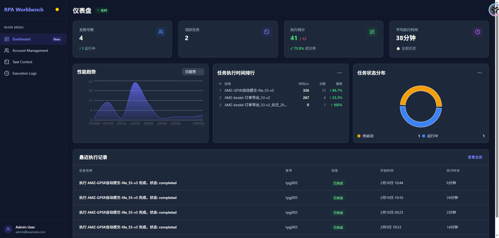
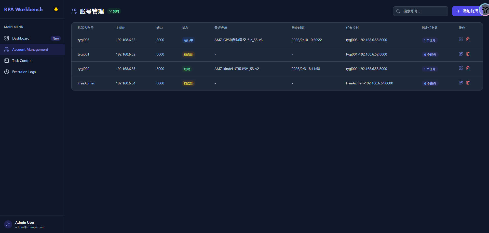
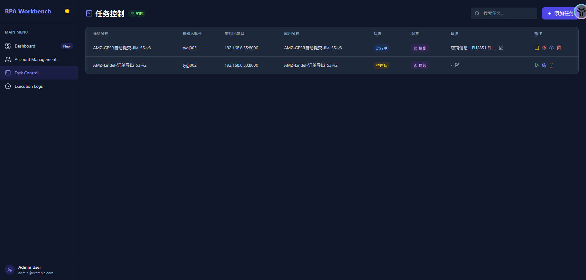

# RPA Workbench

<div align="center">

[](https://github.com/redballoom/RPA-workbench/stargazers)
[](https://github.com/redballoom/RPA-workbench/network)
[](LICENSE)

**RPA 机器人流程自动化管理平台** - 用于监控和控制影刀（ShadowBot）自动化任务。

</div>

---

## ✨ 功能特性

| 功能 | 描述 |
|------|------|
| 📊 **仪表盘** | 实时统计和性能趋势展示，执行排行 |
| 👥 **账号管理** | 管理多个影刀机器人账号，状态同步 |
| ⚙️ **任务控制** | 创建、编辑、启动、停止 RPA 任务 |
| 📝 **执行日志** | 查看任务执行记录、截图和日志详情 |
| 🔄 **SSE 实时更新** | 无需刷新页面，数据自动同步 |

---

## 📸 页面预览

### 仪表盘


### 账号管理


### 任务控制


### 执行日志


---

## 🛠️ 技术栈

| 层级 | 技术选型 |
|------|----------|
| 前端 | React 18 + TypeScript + Vite + TailwindCSS |
| 后端 | FastAPI + Python 3.12+ + SQLAlchemy (异步) |
| 数据库 | SQLite (aiosqlite) |
| 实时通信 | Server-Sent Events (SSE) |
| 存储 | 阿里云 OSS (截图/日志) |

---

## 🚀 快速开始

### 1. 克隆项目

```bash
git clone git@github.com:redballoom/RPA-workbench.git
cd RPA-workbench
```

### 2. 安装依赖

```bash
./install.sh
```

### 3. 启动服务

```bash
# 启动前后端服务
./start.sh

# 或分别启动
./start.sh backend  # 后端 (端口 8888)
./start.sh frontend # 前端 (端口 3000)
```

### 4. 访问应用

- **前端页面**: http://localhost:3000
- **API 文档**: http://localhost:8888/docs
- **ReDoc**: http://localhost:8888/redoc

---

## 📁 项目结构

```
RPA-workbench/
├── backend/                    # FastAPI 后端
│   ├── app/
│   │   ├── api/v1/            # API 路由
│   │   ├── models/            # SQLAlchemy 数据模型
│   │   ├── schemas/           # Pydantic 模式定义
│   │   ├── services/          # 业务逻辑层
│   │   ├── repositories/       # 数据访问层
│   │   └── core/              # 配置和安全
│   ├── requirements.txt       # Python 依赖
│   └── rpa_app.db             # SQLite 数据库
├── frontend/                   # React 前端
│   ├── src/
│   │   ├── pages/             # 页面组件
│   │   ├── lib/               # API 客户端
│   │   └── hooks/             # 自定义 Hooks
│   ├── package.json           # Node 依赖
│   └── dist/                  # 构建产物
├── imgs/                      # 项目截图
├── doc/                       # 文档和设计文件
├── install.sh                 # 安装脚本
├── start.sh                   # 启动脚本
└── README.md                  # 项目说明
```

---

## 📖 使用说明

### Webhook 接口

影刀（ShadowBot）通过 webhook 回调执行结果：

**执行完成回调**
```json
POST /api/v1/webhook/execution-complete
{
  "shadow_bot_account": "账号名",
  "app_name": "应用名",
  "status": "completed",
  "start_time": "2026-01-30 12:00:00",
  "end_time": "2026-01-30 12:01:00",
  "duration_seconds": 60,
  "screenshot_url": "/path/to/screenshot.png",
  "log_url": "/path/to/log.txt"
}
```

**任务确认**
```json
POST /api/v1/webhook/confirm
{
  "shadow_bot_account": "账号名",
  "app_name": "应用名",
  "action": "START"
}
```

### 状态说明

| 实体 | 状态 | 说明 |
|------|------|------|
| 账号 | pending | 空闲 |
| | running | 任务执行中 |
| | completed | 最近任务成功 |
| | failed | 最近任务失败 |
| 任务 | pending | 待执行 |
| | running | 执行中 |
| 日志 | completed | 成功 |
| | failed | 失败 |

---

## 🔗 API 端点

| 端点 | 方法 | 说明 |
|------|------|------|
| `/api/v1/accounts` | GET | 账号列表 |
| `/api/v1/accounts` | POST | 创建账号 |
| `/api/v1/tasks` | GET | 任务列表 |
| `/api/v1/tasks` | POST | 创建任务 |
| `/api/v1/tasks/{id}/start` | POST | 启动任务 |
| `/api/v1/tasks/{id}/stop` | POST | 停止任务 |
| `/api/v1/logs` | GET | 执行日志 |
| `/api/v1/dashboard/stats` | GET | 统计数据 |
| `/api/v1/dashboard/performance` | GET | 性能趋势 |
| `/api/v1/sse/events` | GET | SSE 实时事件 |

---

## 📚 文档

- [后端 README](backend/README.md) - 后端开发详细说明
- [前端 README](frontend/README.md) - 前端开发详细说明
- [API 文档](doc/new_api.md) - 完整 API 接口文档
- [任务进度](doc/TASKS_PROGRESS.md) - 开发进度追踪

---

## 📝 License

MIT License - see [LICENSE](LICENSE) 文件了解详情。
